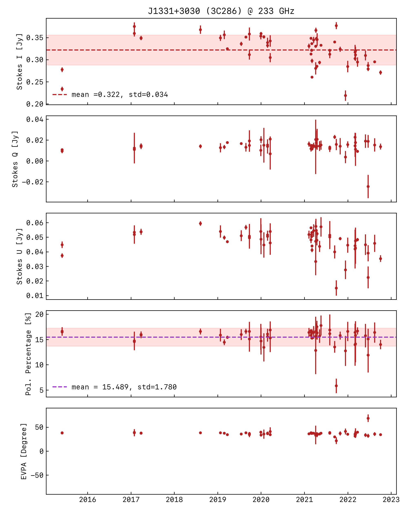
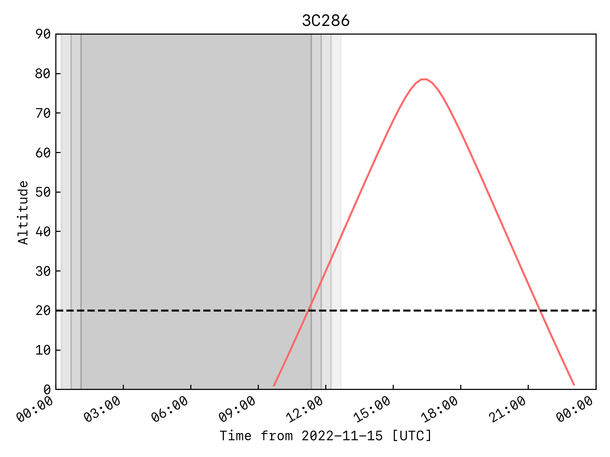
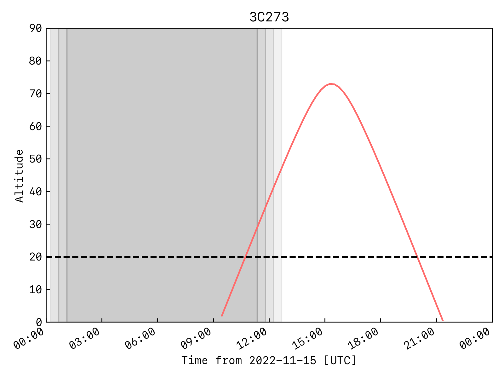

# TolTEC Polarization Calibration

- Altitude vs. Time plots can also be made using the [TolTEC Observation Planner](http://toltec.lmtgtm.org/toltec_obs_planner)

#### Requirements:
- Minimum Polarized Flux
    - 7.5 mJy @ 1.1 mm
    - 3.0 mJy @ 3.0 mm
- Minimum Fractional Polarization
    - p = 10%

### Sources from the Proposal

#### 3C286 (J1331+3030)
[AMAPOLA Dashboard](http://www.alma.cl/~skameno/AMAPOLA/J1331+3030.flux.html)

#### 3C147

#### 3C273 (J1229+0203)
[AMAPOLA Dashboard](http://www.alma.cl/~skameno/AMAPOLA/J1229+0203.flux.html)

